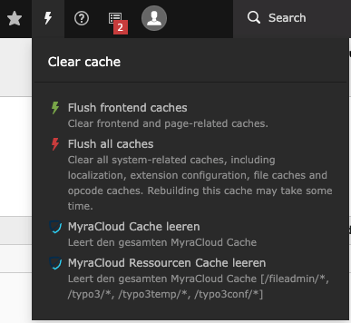
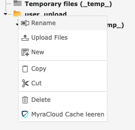
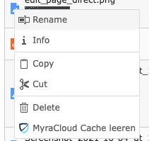
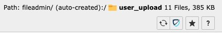

# Filelist

There are 4 ways to clear the Files 
* Backend CacheMenu (clear all)
* Context Menu in FileTree and in Filelist (left/right-click)
* ButtonBar in Filelist
* FileList Update Hook

The Backend Menu is Only Visible if the Backend-User has the permission.
If the MenuPoint is not visible, check
* [Admin Only UI Elements](Settings.md#Admin Only UI Elements)
* [Production only](Settings.md#Production only)
* [Domain Blacklist](Settings.md#Domain Blacklist)
* Missing Myra Credentials

All filelist clear-cache are recursive.

## Backend CacheMenu

## File Context Menu

this will clear the entire directory recursive based on the selected directory/File

The Context menu can be accessed via click on the FileTree

or click on the left file icon in the filelist

## ButtonBar in Filelist

this will clear the entire directory recursive based on the current path

# Hook

See: [Hooks # File Overwrite](Hooks.md#File Overwrite)