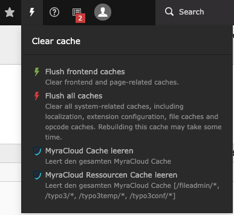

# Page

There are 4 ways to clear the Files
* Backend CacheMenu (clear all)
* Context Menu in PageTree (left/right-click)
* ButtonBar in Menu in Page/List/View
* Page/Content Update Hook

  The Backend Menu is Only Visible if the Backend-User has the permission.
  If the MenuPoint is not visible, check
* [Admin Only UI Elements](Settings.md#Admin Only UI Elements)
* [Production only](Settings.md#Production only)
* [Domain Blacklist](Settings.md#Domain Blacklist)
* Missing Myra Credentials

All page clear-cache are NOT recursive. (except the all clear)

## Backend CacheMenu

Clear the entire Site

## Context Menu

This will only clear the selected Item not SubItems, This clear also not file Resources.

## ButtonBar

This will only clear the selected Item not SubItems, This clear also not file Resources.

## Hook

See: [Hooks # Page Update](Hooks.md#Page Update)