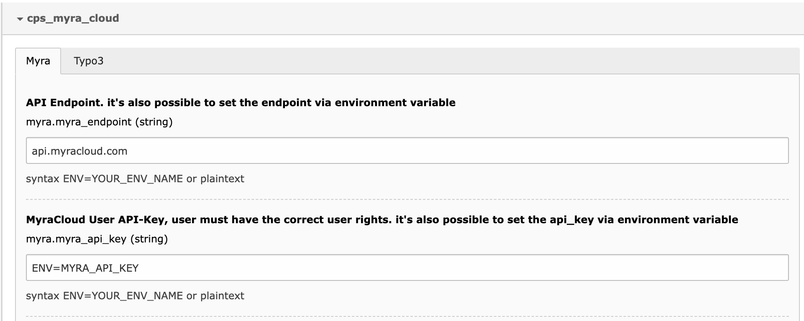
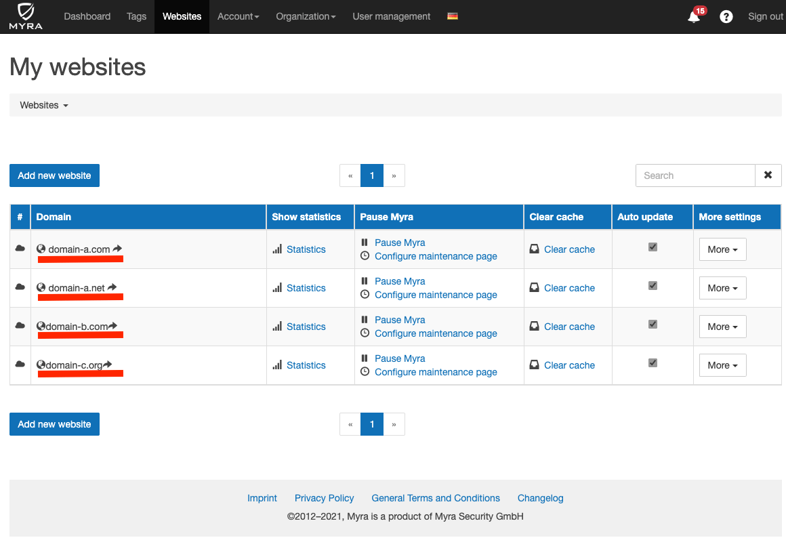

# Setup

* [Myra Settings](#Myra Settings)
* [TYPO3 Site Settings](#TYPO3 Site Settings)
* [TYPO3 Feature Settings](#TYPO3 Feature Settings)

most Settings are made in    
`Admin Tools > Settings > Extension Configuration > cps_myra_cloud`


### Environment injection
All Input settings can made via plaintext or `Environment injection`



Every config that start with `ENV=` will be parsed and interpreted with the provided Environment Name.

syntax: 
```dotenv
ENV=MYRA_API_KEY # results in getenv('MYRA_API_KEY')
```

## Myra Settings

Myra API setup

### Myra API Endpoint

The MyraCloud API endpoint for every request. 

### Myra API Key

a MyraCloud User API KEY (who has the permissions to clear the domain).

### Myra API Secret

the matching Secret for the API-key.

## TYPO3 Site Settings

To link TYPO3 with MyraCloud it's necessary to announce the used MyraCloud Domains for a TYPO3 Site Entity.

`Site Management > Edit [SiteXYZ] > MyraCloud > Myra Domain List`

This is a Comma Separated List for all Myra Domains, this particular Site supports. 
You Can find the correct Names in MyraCloud Backend under myracloud.com



## TYPO3 Feature Settings

TYPO3 Feature Toggle.

### Production only

This Checkbox prevents any MyraCloud Clear Request and Disable all UI Elements if TYPO3 is not in Production mode.

This is Useful to prevent clear requests from Stage / Development instances.

### Admin Only UI Elements

This Checkbox disabled all UI / Context Elements for non-Admin BE-User. 
AutoClear Hooks (like Clear Page on Edit or FileList overwrite) are not affected by this.

### Disable Hooks

This Checkbox disbale all AutoClear Hooks (like Clear Page on Edit or FileList overwrite).

### Domain Blacklist

This Comma Separated Blacklist prevents any MyraCloud Clear Request and Disable all UI Elements if TYPO3 is used over a provided Domain.

This did not affect CLI Command Mode